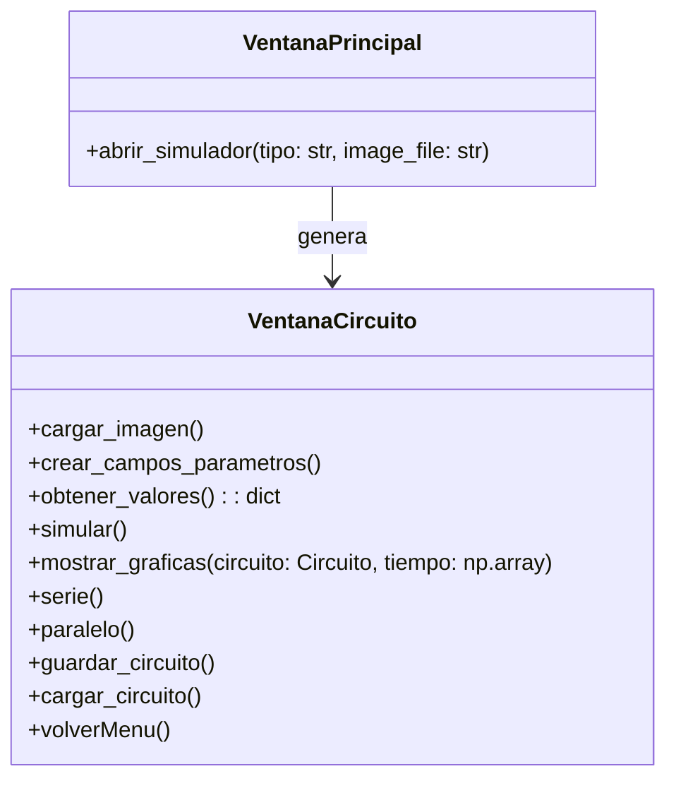
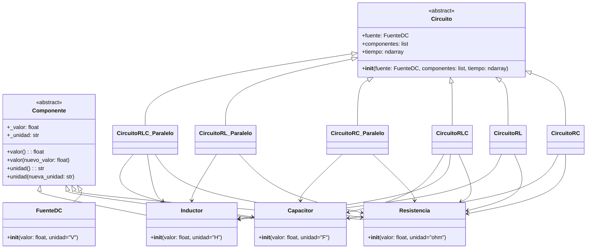
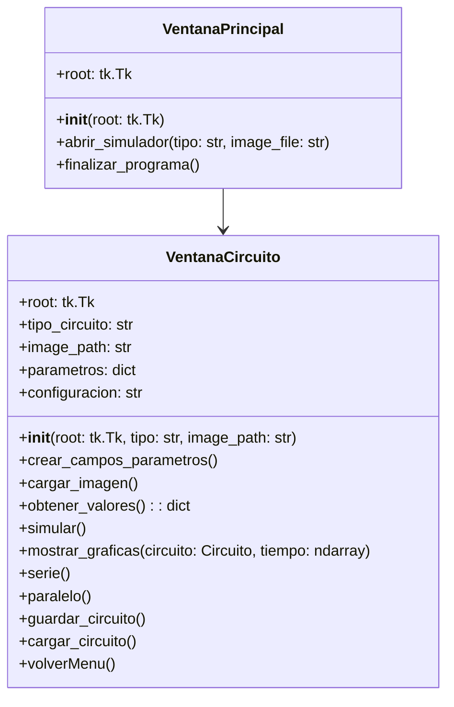

# **Simulador de Circuitos**

## 📖 Índice:
+ [Integrantes](#integrantes)
+ [Alternativa](#alternativa-4)
+ [Solución Preliminar](#solución-preliminar)
    + [Interfaz de Usuario](#parte-1-interfaz-de-usuario-gui)
        + [Frame 1: Menú](#frame-1-menú)
        + [Frame 2: Simulador](#frame-2-simulador)
        + [Diagrama de clases](#diagrama-de-clases-de-la-interfaz)
    + [Lógica del simulador](#parte-2-lógica-para-la-simulación-de-los-circuitos)
        + [Clases (Componentes)](#clases-componentes)
        + [Clases (Circuitos)](#clases-circuitos)
        + [Diagrama de clases](#diagrama-de-clases)
+ [Fórmulas Matemáticas](#fórmulas-matemáticas)
+ [Aspectos de POO](#aspectos-de-poo)
+ [Casos de Uso](#casos-de-uso)
+ [Inspiración para la interfaz](#inspiración-para-la-interfaz)

---

## **Integrantes**
+ Juan Manuel Toro Rojas
+ Héctor Miller Patiño Avellaneda
+ Miguel Ángel Tovar Rincón

---

## **Alternativa 4**
Desarrollar una aplicación en Python que permita simular circuitos RC, RL y RLC simples. Condiciones:

+ Código original.
+ Uso de herramientas vistas en el curso (CLASES) - Los componentes deben aplicar el enfoque de POO (por ejemplo, una resistencia debe tener atributos como resistividad, potencia, etc.).
+ Se deben poder configurar los componentes en serie y en paralelo.
+ Se deben trabajar con fuentes de tensión en DC únicamente.
+ El resultado de la simulación debe ser una representación gráfica de la tensión/corriente en cada uno de los componentes.
+ Se pueden utilizar módulos externos para la solución de los componentes numéricos.

**Características extra:**
+ Hacer análisis en el dominio AC.

---

## **Solución Preliminar**
Para desarrollar este simulador de circuitos simples **RC, RL y RLC**, es necesario tener en cuenta las partes que se deben desarrollar. Para esta alternativa se requiere:
+ Interfaz de usuario (GUI).
+ Lógica para la simulación de los circuitos.

---

### **Parte 1: Interfaz de Usuario (GUI)**
***
#### **Frame 1: Menú**
En esta parte, se presenta un mensaje de bienvenida y el usuario verá un menú principal que le permitirá seleccionar entre los tres tipos de circuitos que se pueden simular: RC, RL y RLC. Este menú será el primer frame que el usuario encontrará al iniciar la aplicación.

**Características del Menú:**
+ Señal RC: Simulación de un circuito RC (Resistencia y Capacitor).
+ Señal RL: Simulación de un circuito RL (Resistencia e Inductor).
+ Señal RLC: Simulación de un circuito RLC (Resistencia, Inductor y Capacitor).

#### **Frame 2: Simulador** 
Este frame será una interfaz sencilla en la que el usuario podrá observar el circuito seleccionado en el menú anterior. Adicionalmente, en un contenedor ubicado en la parte derecha de la pantalla, el usuario podrá ingresar los parámetros de cada componente del circuito en cajas de texto. Los valores que se pueden ingresar son:
+ Resistencia.
+ Capacitor.
+ Inductor.
+ Fuente de energía.

Finalmente, el usuario podrá observar los datos del circuito en forma de gráficos en un contenedor ubicado en la parte inferior de la ventana. También habrá una opción para volver al menú principal y la opción de realizar la simulación con los mismos componentes en un circuito en serie y paralelo.

---

### **Diagrama de clases de la interfaz**
A continuación, se presenta el diagrama de clases de la GUI:

**Class VentanaPrincipal:**
Es la ventana inicial del simulador, donde el usuario puede seleccionar el tipo de circuito (RC, RL o RLC). Contiene un método para abrir la ventana de simulación correspondiente.

**Class VentanaCircuito:**
Se genera cuando el usuario selecciona un tipo de circuito. Contiene métodos para cargar la imagen del circuito, crear campos de parámetros, obtener valores ingresados, simular el circuito, mostrar gráficas, cambiar la configuración del circuito (serie o paralelo), guardar y cargar circuitos, y volver al menú principal.

---

### **Parte 2: Lógica para la simulación de los circuitos**
***
Para el desarrollo de la lógica del simulador, hay que tener en cuenta los factores que pueden afectar los valores de la simulación, tales como los parámetros de cada componente y si el circuito es en serie o en paralelo. Un buen primer paso es definir **qué objetos existirán** en este simulador, posteriormente **qué datos deben ser ingresados** y **qué datos pueden ser generados**, para finalmente desarrollar una **salida de datos en forma de diagramas y estadísticas**.

#### **Clases (Componentes):**
+ **Componente**: Es la clase base para los diferentes componentes del circuito. Contiene el valor numérico y la unidad de medida. Además, tiene métodos para obtener y modificar el valor y la unidad.
    + **FuenteDC**: Representa una fuente de voltaje DC. Hereda de `Componente` y valida que la unidad sea voltios (V).
    + **Resistencia**: Representa una resistencia. Hereda de `Componente` y valida que la unidad sea ohmios (Ω).
    + **Capacitor**: Representa un capacitor. Hereda de `Componente` y valida que la unidad sea faradios (F).
    + **Inductor**: Representa un inductor. Hereda de `Componente` y valida que la unidad sea henrios (H).

#### **Clases (Circuitos):**
+ **Circuito**: Es la clase base que representa un circuito eléctrico genérico. Contiene una fuente de voltaje DC y una lista de componentes. Además, define un rango de tiempo para la simulación.
    + **CircuitoRC**: Representa un circuito RC (Resistencia y Capacitor). Hereda de `Circuito` y contiene métodos para calcular el voltaje en la resistencia y el capacitor, así como la corriente del circuito.
    + **CircuitoRL**: Representa un circuito RL (Resistencia e Inductor). Hereda de `Circuito` y contiene métodos para calcular la corriente del circuito, el voltaje en la resistencia y el voltaje en el inductor.
    + **CircuitoRLC**: Representa un circuito RLC (Resistencia, Inductor y Capacitor). Hereda de `Circuito` y contiene métodos para calcular la corriente del circuito, el voltaje en la resistencia, el voltaje en el inductor y el voltaje en el capacitor.
    + **CircuitoRC_Paralelo**: Representa un circuito RC en paralelo. Hereda de `Circuito` y contiene métodos para calcular el voltaje del circuito, la corriente en la resistencia, la corriente en el capacitor y la corriente total.
    + **CircuitoRL_Paralelo**: Representa un circuito RL en paralelo. Hereda de `Circuito` y contiene métodos para calcular el voltaje del circuito, la corriente en la resistencia, la corriente en el inductor y la corriente total.
    + **CircuitoRLC_Paralelo**: Representa un circuito RLC en paralelo. Hereda de `Circuito` y contiene métodos para calcular el voltaje del circuito, la corriente en la resistencia, la corriente en el inductor, la corriente en el capacitor y la corriente total.

---

### **Fórmulas Matemáticas**
Las fórmulas utilizadas en las simulaciones de los circuitos son las siguientes:

1. **Circuito RC (Serie):**
   - Voltaje en la resistencia:

     

   - Voltaje en el capacitor:

     
     
   - Corriente en el circuito:

     

2. **Circuito RL (Serie):**
   - Corriente en el circuito:

     

   - Voltaje en la resistencia:

     

   - Voltaje en el inductor:

     

3. **Circuito RLC (Serie):**
   - Corriente en el circuito:

     

   - Voltaje en la resistencia:

     

   - Voltaje en el inductor:

     

   - Voltaje en el capacitor:
   
     

4. **Circuito RC (Paralelo):**
   - Voltaje en el circuito:

     

   - Corriente en la resistencia:

     

   - Corriente en el capacitor:

     

   - Corriente total:
  
     

5. **Circuito RL (Paralelo):**
   - Voltaje en el circuito:

     

   - Corriente en la resistencia:
  
     

   - Corriente en el inductor:

     

   - Corriente total:

     

6. **Circuito RLC (Paralelo):**
   - Voltaje en el circuito:

    

   - Corriente en la resistencia:

     

   - Corriente en el inductor:

     

   - Corriente en el capacitor:

     

   - Corriente total:

     

---

### **Aspectos de POO**
El código utiliza varios conceptos de Programación Orientada a Objetos (POO) para estructurar la lógica del simulador:

1. **Herencia:**
   - Las clases `FuenteDC`, `Resistencia`, `Capacitor` e `Inductor` heredan de la clase base `Componente`. Esto permite reutilizar código y definir comportamientos comunes para todos los componentes.
   - Las clases `CircuitoRC`, `CircuitoRL`, `CircuitoRLC`, `CircuitoRC_Paralelo`, `CircuitoRL_Paralelo` y `CircuitoRLC_Paralelo` heredan de la clase base `Circuito`. Esto permite definir comportamientos específicos para cada tipo de circuito.

2. **Encapsulamiento:**
   - Los atributos de las clases están encapsulados mediante el uso de propiedades (`@property`). Esto permite controlar el acceso y la modificación de los valores de los componentes, asegurando que no se asignen valores inválidos.

3. **Polimorfismo:**
   - Cada tipo de circuito implementa sus propios métodos para calcular voltajes y corrientes, pero todos comparten una interfaz común gracias a la herencia. Esto permite que la simulación se realice de manera uniforme, independientemente del tipo de circuito.

4. **Abstracción:**
   - La clase `Componente` es una abstracción que define los atributos y métodos comunes a todos los componentes del circuito. Las clases derivadas implementan detalles específicos.

---

### **Casos de Uso**
1. **Simulación de un circuito RC en serie:**
   - El usuario selecciona el circuito RC en el menú principal.
   - Ingresa los valores de la resistencia, el capacitor y la fuente de voltaje.
   - El simulador calcula y muestra las gráficas de voltaje en la resistencia, voltaje en el capacitor y corriente en el circuito.

2. **Simulación de un circuito RL en paralelo:**
   - El usuario selecciona el circuito RL en el menú principal.
   - Ingresa los valores de la resistencia, el inductor y la fuente de voltaje.
   - El simulador calcula y muestra las gráficas de voltaje en el circuito, corriente en la resistencia, corriente en el inductor y corriente total.

3. **Guardar y cargar configuraciones:**
   - El usuario puede guardar los valores de los componentes en un archivo JSON.
   - Posteriormente, puede cargar estos valores para realizar una simulación sin necesidad de ingresar los datos nuevamente.

4. **Cambiar entre serie y paralelo:**
   - El usuario puede cambiar la configuración del circuito entre serie y paralelo para observar cómo afecta el comportamiento del circuito.

---

### **Inspiración para la interfaz**
Un apoyo para la realización de este proyecto es una calculadora desarrollada el semestre pasado, en la que adquirimos conocimientos para programar y crear una interfaz gráfica y proyectar datos por medio de gráficos. Dicha calculadora se encuentra en el siguiente repositorio de GitHub:
+ [Calculadora en GitHub](https://github.com/Mike-arch-code/Calculadora)

---

Este proyecto combina conceptos de programación orientada a objetos, matemáticas aplicadas y diseño de interfaces gráficas para proporcionar una herramienta útil y educativa para la simulación de circuitos eléctricos simples.

### Diagrama de Lógica (Circuitos y Componentes)

### Diagrama de Interfaz (GUI)

